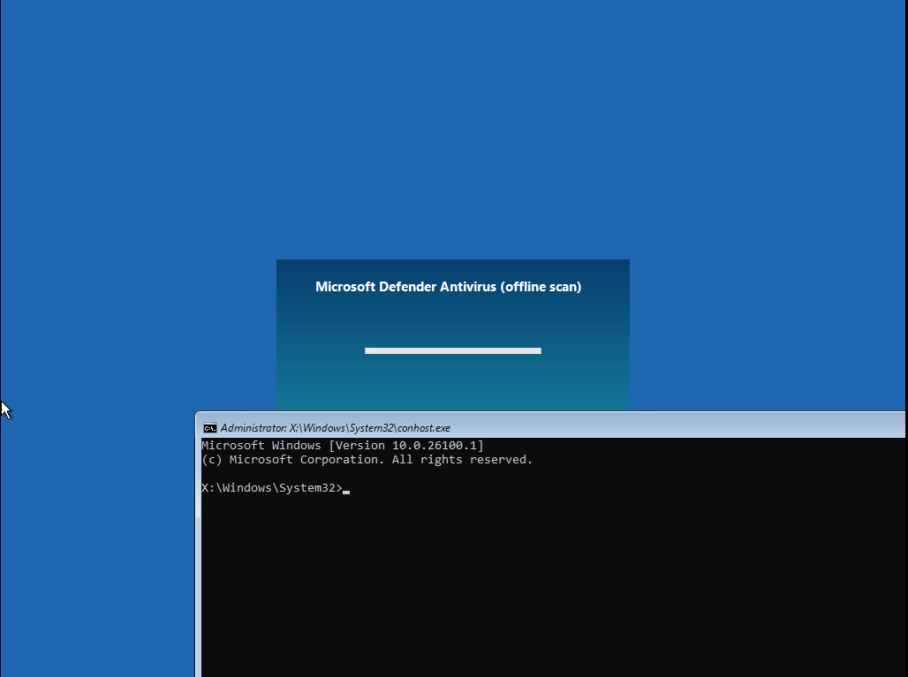

<div align="center">

# GreatXML

### Windows Recovery Environment (WinRE) BitLocker Bypass


**Security Research**

*Analysis and documentation of a patched Windows vulnerability.*

</div>

---

# 📖 Overview

GreatXML documents a vulnerability affecting the **Windows Recovery Environment (WinRE)** that allowed arbitrary command execution during the Microsoft Defender Offline Scan recovery workflow.

The issue originated from the interaction between **WinRE**, **Windows Setup**, and **Microsoft Defender Offline Scan**. Under specific conditions, WinRE processed an attacker-controlled `unattend.xml` before presenting the recovery interface, causing Windows Setup to execute commands defined within the unattended configuration.

Because the operating system volume had already been unlocked by WinRE for the recovery session, any successfully executed process inherited unrestricted access to the decrypted BitLocker volume.

This repository documents the vulnerability, explains its root cause, and preserves the technical research for educational and defensive purposes.

---

# 🔍 Root Cause

The vulnerability was not caused by BitLocker itself, but by the interaction of several trusted Windows components.

During a Microsoft Defender Offline Scan, Windows boots into the Windows Recovery Environment to perform an offline antivirus scan. Before the scan begins, WinRE initializes Windows Setup components responsible for unattended deployment.

Windows Setup automatically searches for and parses an `unattend.xml` configuration file. The unattended installation mechanism supports the `RunSynchronous` directive during the `windowsPE` phase, allowing commands to execute very early in the boot process.

Under the affected conditions, WinRE accepted an attacker-controlled unattended configuration and executed its commands before normal recovery initialization completed.

Because WinRE had already unlocked the BitLocker-protected operating system partition for the recovery session, those processes executed with unrestricted access to the decrypted volume.

The issue therefore resulted from a trusted execution path inside WinRE rather than from a weakness in BitLocker encryption.

---

# 🔬 Technical Analysis

When Microsoft Defender Offline Scan is scheduled, WinRE stores the pending operation inside its recovery configuration.

A typical recovery configuration contains entries similar to:

```xml
<OperationParam path="\ProgramData\Microsoft\Windows Defender\Offline Scanner\OfflineScannerShell.exe ..." />
<ScheduledOperation state="15"/>
```

During recovery startup, Windows Setup processes unattended installation files before launching the Defender Offline Scanner.

The supplied `unattend.xml` uses the standard Windows unattended deployment mechanism and defines commands within the `RunSynchronous` section executed during the `windowsPE` configuration pass.

Because these commands execute before the recovery interface becomes available, arbitrary processes can be started directly from WinRE.

At that point, the operating system partition has already been unlocked by the recovery environment, allowing those processes to access the decrypted BitLocker volume without requiring Windows credentials or the BitLocker recovery key.

This execution chain demonstrates how multiple legitimate Windows components unintentionally combined to create a path for arbitrary code execution inside WinRE.

---

# 🎯 Affected Scenario

The vulnerability affected systems entering the Microsoft Defender Offline Scan workflow through the Windows Recovery Environment.

The vulnerable state occurred after Defender Offline Scan had been scheduled or initiated, causing WinRE to boot into a specialized recovery session where unattended setup processing occurred before the offline scanner was launched.

Only systems entering this recovery workflow were affected by this behavior.

Microsoft has since addressed the issue through security updates.

---

# 💥 Impact

Successful exploitation could allow an attacker with physical access to execute arbitrary commands within the Windows Recovery Environment before normal authentication.

Since WinRE had already unlocked the operating system volume for recovery purposes, the executed process inherited unrestricted access to the decrypted BitLocker partition.

Potential consequences included:

* Arbitrary command execution within WinRE.
* Access to unlocked BitLocker-protected volumes.
* Reading, modifying, copying, or deleting files on the operating system partition.
* Offline modification of Windows system files.
* Access to sensitive information stored on the unlocked filesystem.
* Bypass of the normal Windows logon process by operating entirely within the recovery environment.

The vulnerability did **not** compromise BitLocker cryptography. Instead, it abused the trusted recovery workflow after the encrypted volume had already been legitimately unlocked by Windows.

---

## 📸 Demonstration

### WinRE Shell



### Unlocked BitLocker Volume


---

# 📂 Repository Structure

```text
GreatXML/
│
├── Recovery/
├── unattend.xml
├── assets
└── README.md
```

---

# ⚠️ Disclaimer

This repository is provided exclusively for:

* Security research
* Defensive security analysis
* Vulnerability documentation
* Educational purposes

The vulnerability documented in this repository has been patched.

The information provided is intended to document the technical details of the issue, preserve the research, and assist defenders and researchers in understanding the vulnerability and its remediation.


